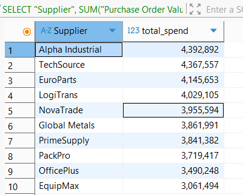
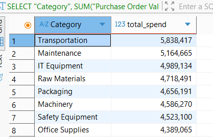
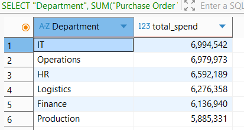
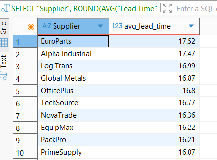
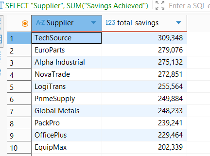
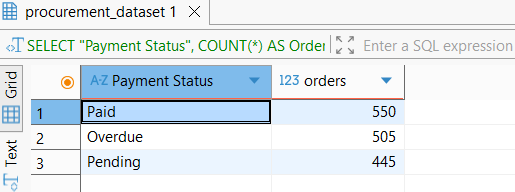

# Procurement Spend Analysis Using PostgreSQL

## Overview

This project analyzes procurement spending data using PostgreSQL and SQL queries. The objective is to identify spending patterns, evaluate supplier performance, monitor lead times, measure savings achieved, and assess payment status distribution to support procurement decision-making.

The analysis was performed using PostgreSQL and DBeaver, demonstrating SQL skills commonly used in procurement, supply chain, and business analytics roles.

## Dataset

The dataset contains procurement transactions with the following fields:

- Purchase Date
- Supplier
- Category
- Department
- Purchase Order Value
- Lead Time
- Savings Achieved
- Payment Status

## Tools Used

- PostgreSQL
- DBeaver
- SQL

---

## SQL Analysis Performed

### 1. Top Suppliers by Procurement Spend
Identified suppliers with the highest procurement expenditure.

### 2. Procurement Spend by Category
Analyzed spending across procurement categories such as Raw Materials, IT Equipment, Transportation, Packaging, and Office Supplies.

### 3. Procurement Spend by Department
Compared procurement activity across departments including Production, Logistics, Finance, HR, IT, and Operations.

### 4. Average Lead Time by Supplier
Evaluated supplier efficiency by measuring average lead times.

### 5. Savings Achieved by Supplier
Measured supplier contribution to procurement savings.

### 6. Payment Status Analysis
Analyzed procurement orders by payment status:
- Paid
- Pending
- Overdue

## Key Findings

- Procurement spending was concentrated among a limited number of suppliers.
- Certain procurement categories generated significantly higher spending than others.
- Lead times varied between suppliers, indicating opportunities for supplier performance improvement.
- Savings achieved differed across suppliers.
- Most procurement transactions were processed successfully, while some remained pending or overdue.

### Supplier Performance

- Alpha Industrial generated the highest procurement spend at **€4.39 million**.
- TechSource followed closely with **€4.37 million** in procurement expenditure.
- EquipMax recorded the lowest procurement spend among the analyzed suppliers at **€3.06 million**.

### Category Analysis

- Transportation represented the largest spending category with **€5.84 million**.
- Maintenance and IT Equipment were also major procurement cost drivers at **€5.16 million** and **€4.99 million** respectively.
- Office Supplies recorded the lowest spending at **€4.39 million**.

### Department Analysis

- The IT department generated the highest procurement spend at **€6.99 million**.
- Operations and HR followed closely with **€6.98 million** and **€6.59 million** respectively.
- Production recorded the lowest departmental expenditure at **€5.89 million**.

### Supplier Efficiency

- EuroParts had the highest average lead time at **17.52 days**, indicating potential delays in procurement processes.
- PrimeSupply achieved the lowest average lead time at **16.07 days**, demonstrating relatively better delivery performance.

### Cost Savings

- TechSource generated the highest procurement savings of approximately **€309,000**.
- EuroParts and Alpha Industrial also delivered significant savings exceeding **€275,000**.
- EquipMax generated the lowest savings among suppliers at approximately **€202,000**.
### Payment Status

- Most procurement transactions were successfully paid (**550 orders**).
- **505 orders** remained overdue.
- **445 orders** were still pending payment.

The relatively high number of overdue and pending transactions may indicate opportunities to improve payment monitoring and supplier relationship management.

---
## Business Analysis

The results suggest that procurement spending is distributed fairly evenly among suppliers, reducing dependence on a single vendor and lowering supply risk.

However, Transportation, Maintenance, and IT Equipment account for a significant share of procurement costs and should be prioritized for cost optimization initiatives.

Supplier lead times are relatively consistent, but the performance gap between EuroParts and PrimeSupply indicates opportunities for supplier performance benchmarking.

The large number of overdue payments may negatively affect supplier relationships and should be addressed through stronger payment tracking processes.

---
## Recommendations

### 1. Focus on High-Spend Categories

Conduct periodic reviews of Transportation, Maintenance, and IT Equipment spending to identify cost-saving opportunities and negotiate better supplier agreements.

### 2. Implement Supplier Performance Scorecards

Track supplier KPIs such as:

- Procurement Spend
- Lead Time
- Cost Savings
- Delivery Reliability
- Payment Compliance

to support supplier evaluation and selection decisions.

### 3. Reduce Lead Time Variability

Work with suppliers showing longer lead times, particularly EuroParts, to improve delivery performance and reduce procurement delays.

### 4. Improve Payment Monitoring

Establish automated monitoring for pending and overdue payments to improve supplier relationships and reduce operational risk.

### 5. Expand Procurement Analytics

Future analysis could incorporate:

- Supplier risk assessment
- Purchase order forecasting
- Cost trend analysis
- Procurement budget variance analysis
- Spend forecasting models

---

## Author

Fatima-Ezzahra Lasfar
